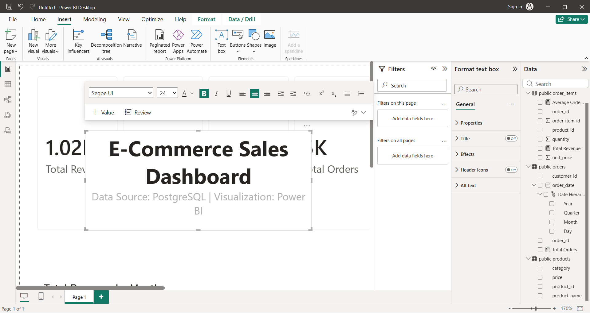
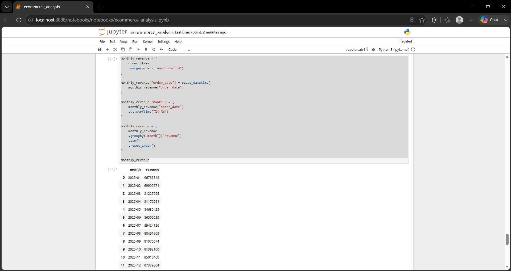
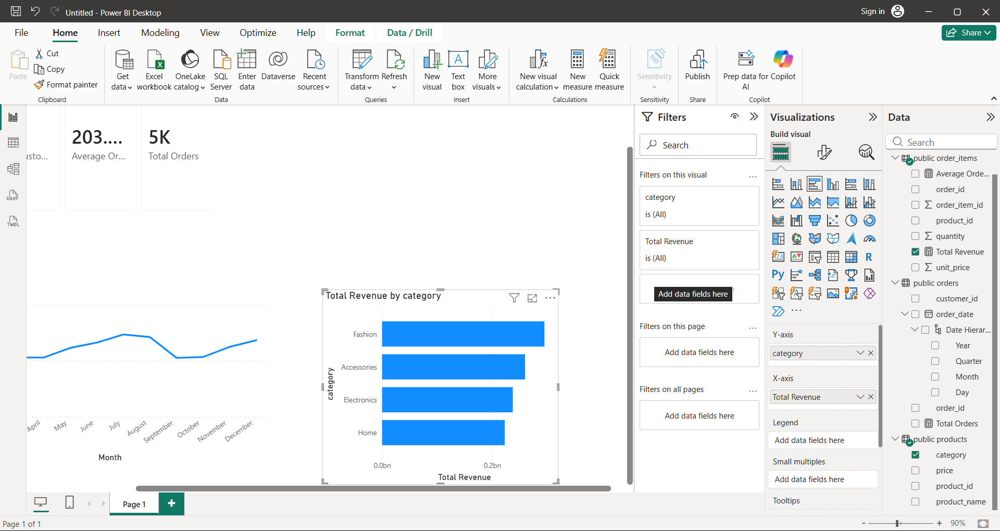

# E-Commerce Sales Analytics

## Project Overview

This project analyzes e-commerce sales data using PostgreSQL, Python, Pandas, SQL, and Power BI.

The objective is to identify revenue trends, customer behavior, product performance, and business opportunities through data analysis.

## Tech Stack

- PostgreSQL
- SQL
- Python
- Pandas
- Matplotlib
- Power BI
- Git & GitHub

## Database Schema

customers
products
orders
order_items

## Analysis Performed

### SQL Analysis

- Total Revenue
- Top Customers
- Revenue by City
- Monthly Sales Trends
- Repeat Customers

### Python Analysis

- Customer Revenue Analysis
- Product Performance Analysis
- Category Analysis
- Monthly Revenue Trends

### Power BI Dashboard

- Total Revenue KPI
- Total Orders KPI
- Total Customers KPI
- Average Order Value KPI
- Monthly Revenue Trend
- Product Analysis
- Category Analysis

## Business Insights

- Identified top-performing products.
- Identified highest revenue categories.
- Analyzed repeat customer behavior.
- Compared city-wise revenue performance.

## Project Structure
Folder PATH listing for volume Windows
Volume serial number is 0000007F 6E6C:91A1
C:.
│   .gitignore
│   README.md
│
├───dashboard
│   ├───powerbi
│   │       ecommerce_dashboard.pbix
│   │
│   └───screenshots
│           dashboard.png
│           dashboard_overview.png.png
│           monthly revenue.png
│           revenue_by_category.png (2).png
│
├───data
│   ├───processed
│   │       customers_large.csv
│   │       orders_large.csv
│   │       order_items_large.csv
│   │       products_large.csv
│   │
│   └───raw
│           customers.csv
│           orders.csv
│           order_items.csv
│           products.csv
│
├───docs
├───notebooks
│   │   data_generator.py
│   │   ecommerce_analysis.ipynb
│   │
│   └───.ipynb_checkpoints
│           ecommerce_analysis-checkpoint.ipynb
│
├───reports
│   ├───business_summary
│   │       analysis_findings.md
│   │       business_insights.md
│   │       insights.md
│   │
│   ├───screenshots
│   │       customer_analysis.png.png
│   │       monthly_revenue_python.png.png
│   │       python_analysis_1.png.png
│   │
│   └───sql_insights
│           best selling.png
│           customer_rank.png.png
│           monthly_revenue.png.png
│           repeat_customers.png.png
│           revenue_by_category.png.png
│           revenue_by_city.png.png
│           top_10_customers.png.png
│           top_customers.png.png
│           top_products.png.png
│
└───sql
    ├───analysis
    │       advanced_analysis.sql
    │       business_queries.sql
    │       monthly_revenue.sql
    │       repeat_customers.sql
    │       revenue_by_category.sql
    │       revenue_by_city.sql
    │       top_customers.sql
    │       top_products.sql
    │
    ├───data_load
    └───schema
            create_tables.sql

## Dashboard Preview

### Full Dashboard

### Monthly Revenue Trend

### Top Products

